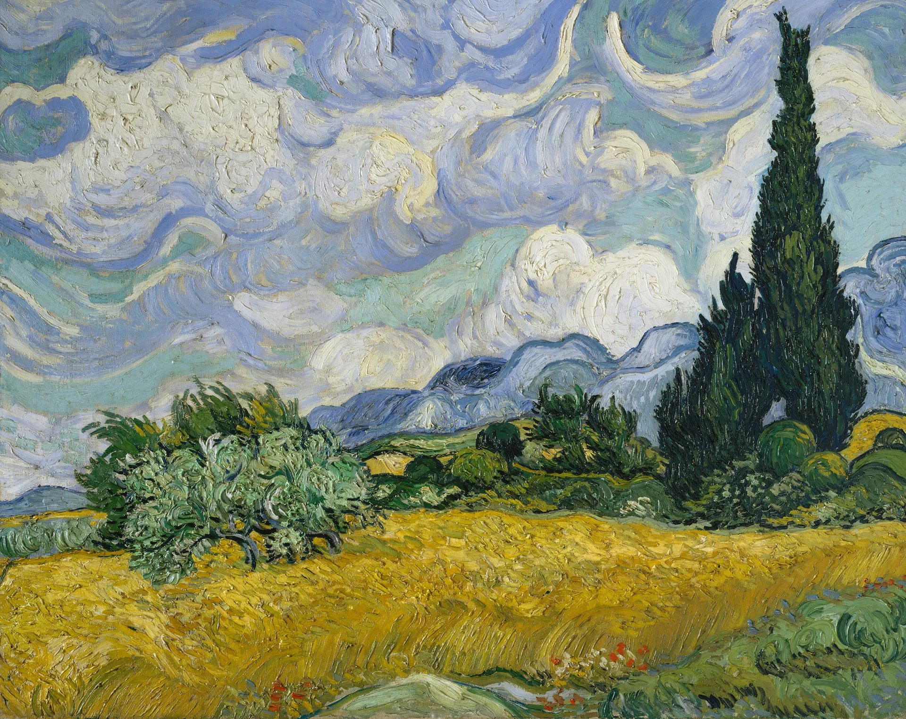
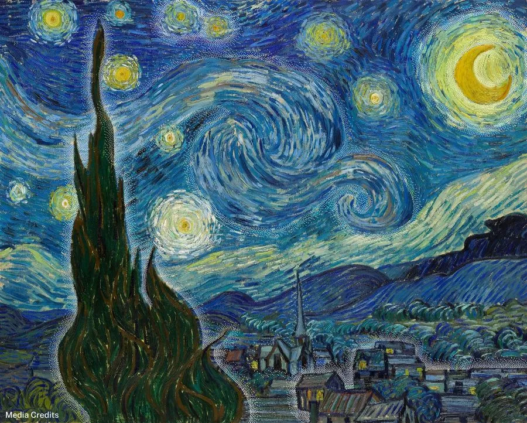

# IDEA9103_Major-Project_skac0968

Method: **User input**

In this prototype, there are five user interactions designed to reflect the passage of time. As the original group piece is a representation of nature, these interactions aim to simulate the natural changes over time.

1. **Mouse drag (Left to right)**: By dragging the mouse from the left side of the canvas to the right side, the size of the circles in the river and the brightness of the sky will change. This represents the change in the time and the evolution of the river. 
   
   Technical overview: 
    - River Circle Size: The size of the river circles (riverCircleSize) is updated based on the horizontal position of the mouse (mouseX). As the mouse moves from left to right, the river circles become larger.
    - Sky Brightness: The sky's brightness (skyBrightness) changes depending on the mouse position (mouseX), where the sky gets brighter as the mouse moves to the right.

2. **Keyboard (up and down arrow)**: If the up arrow key is pressed the tree will become larger and if the down arrow key is pressed the tree will become smaller. This represents the growth and withers of the tree. 

    Technical overview:

    The keyPressed() function checks for the up or down arrow keys and when one of these keys is pressed, it adjusts the treeScale value by 1.1 and calls redraw() to update the drawing.

3. **Keyboard (right and left arrow)**: If the right arrow key is pressed the tree will tilt right and if the left arrow key is pressed the tree will tilt left. This represents the tree's movement in reaction to environmental forces like wind.
    
    Technical overview:

    The keyPressed() function checks for the left and right arrow keys and depending on the key pressed, it adjusts the treeRotation value each by 5 degrees and triggers to redraw the tree.

4. **“T” key**:  If the “T” key is pressed the tree will appear and disappear. This represents the tree’s changing visibility, like how it might be covered by clouds or shifting seasons. 

    Technical overview:

    The keyPressed() function checks if the "T" key is pressed (either uppercase or lowercase) and if the "T" key is pressed, it toggles the boolean value of treeVisible. If treeVisible is true, the tree will be visible on the canvas; if it's false, the tree will not be drawn.

5. **“Change Grass Color” Button**: If the “Change Grass Color” button is pressed, the color of they cylinders representing the grass will change to different shades of green. This represents the change of seasons, symbolising the natural cycle of growth, renewal, and transformation as the landscape shifts throughout the year.

	Technical overview:

    The button to change the cylinder colour is linked to a function called changeCylinderColor() using an event listener. When the button is clicked, a random green colour is generated for the cylinders using the random() function and redraw() is called to refresh the canvas with the new cylinder colour applied.

While not many changes were made to the group code, a few adjustments were implemented to make it feel more natural and cohesive. Such as the color of the tree branch and strokes of the shapes. A Toggle visibility function was used to make the tree appear and disappear. This works by using a boolean variable (treeVisible), which is either true or false and the 'T' key is pressed, the function flips the value of treeVisible using !. This changes it from true to false or vice versa, making the tree either appear or disappear. Finally, the redraw() function is called to refresh the canvas and apply the change. The redraw() function is used because noLoop() is called in the setup(), which stops the draw() function from continuously running. This means the canvas only updates once when the sketch starts, so redraw() is needed to trigger updates after user interactions like mouse movements or key presses.

## **Inspiration**
I was inspired by Vincent Van Gogh’s “Starry Night” which we examined for the group piece and also another one of his artworks “Wheat Field with Cypresses”. The contrast between night and day inspired me to create something that could express a similar change through user input interactions. Each of the interactions allows the user to change different elements in the scene, reflecting changes over time and adjusting the visual elements dynamically.

- Inspiration 1 - *Wheat Field with Cypresses*

    Image from https://www.newyorker.com/culture/the-art-world/the-world-changing-trees-of-vincent-van-gogh 

- Inspiration 2 - *Starry Night*

    Image from https://www.vangoghgallery.com/painting/starry-night.html